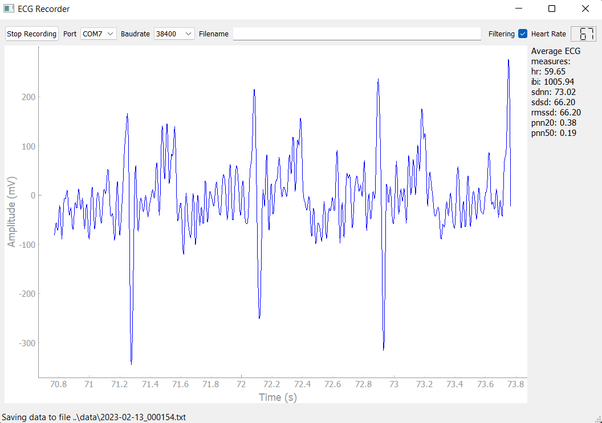
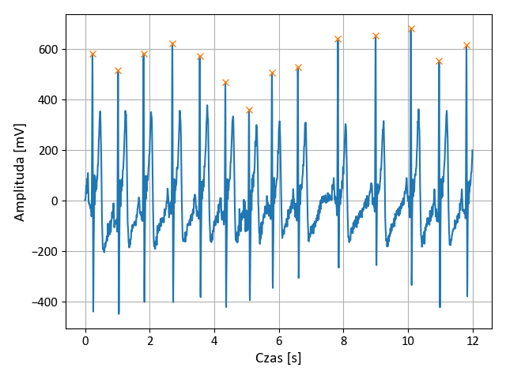

# ECG Recorder

Application for acquisition and analysis of ECG signal

Author: Zuzanna Lewandowska, Warsaw University of Technology, The Faculty of Electronics and Information Technology.
The project has been realized as a part of Master thesis *Single-channel system for ECG signal measurement and analysis* (May 2023).

The program is used to collect, filter, visualize, analyze and record real-time measurement ECG data. It has a graphical user interface which allowed for easy use and options selection. It implements digital filters, an algorithm for finding R-waves in the ECG curve and automatic analysis of heart rate variability.

The graphical user interface of the program during the signal acquisition is depicted in a picture below.

The picture below shows R peaks found with the algorithm implemented in the program during offline signal analysis.

The program was written in Python 3.10 using pyserial, PyQt5, pyqtgraph, numpy, matplotlib, scipy packages.

